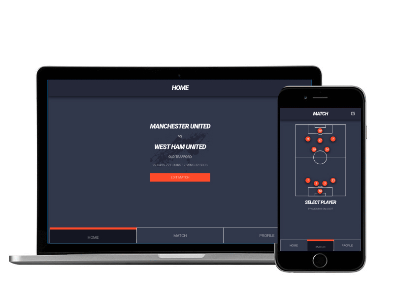

### LAMBY⚽️ - Matchday Lineups made easy
------

Lamby is a progressive webapp that makes it easy for football managers to communicate match line-ups and custom instructions
by displaying them on the in-app screen. Because it is a PWA it works well on any device.

#### Tech Stack
------
This project was built using TypeScript, React.js and Sass on the frontend
and Node.js, Express.js, Sequelize and PostgresQL on the backend.
 
 
#### Running LAMBY
-------

In order to spin op the frontend, navigate to the client folder and run `npm start`
 
To start the backend, navigate to the server folder and run `npm start` 

Matches and players can be manually added from the client-side

 
 
Built with ❤️ by Jasja Prick - <a href='https://www.linkedin.com/in/jasja-prick/' target='_blank'>LinkedIn</a>
